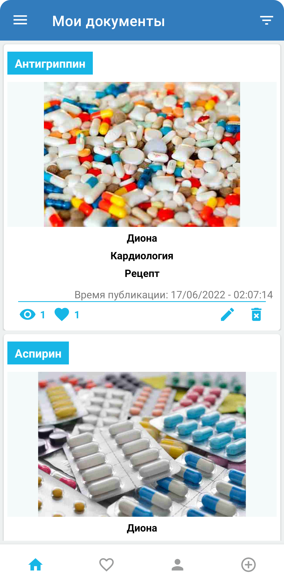
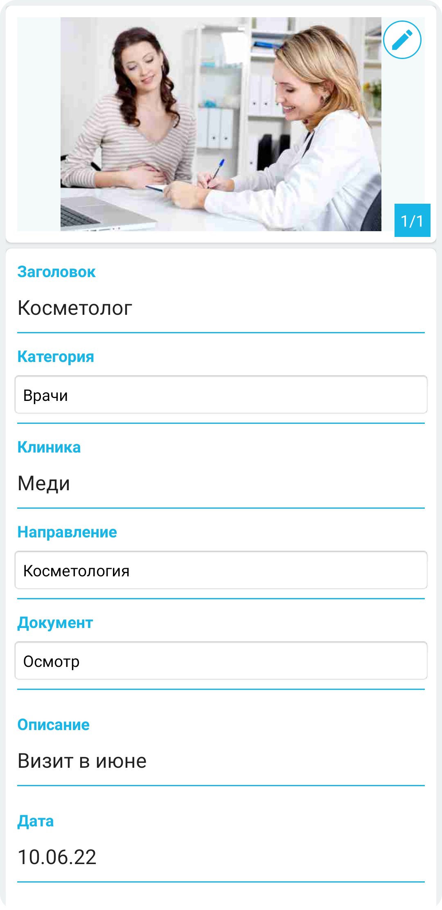

# MedCardHealth
Приложение для хранения медицинских справок, рецептов, анализов, диагнозов, санкнижек, обследований, прививок и других документов.

## Возможности приложения
* Регистрация по email.
* Авторизация по Google аккаунту.
* Подключение к Google Firebase.
* Безопасное сохранение документов и фотографий из памяти телефона в базу данных Firebase.
* Сохранение фотографий в различные категории, такие как анализы, врачи, справки, лекарства, санкнижки, документы, обследования и прививки.  
* Редактирование документов, добавление описания, даты, клиники.
* Поиск по приложению.
* Добавление в избранное.
* Счетчик просмотров.

## Технологический стек
* MVVM
* Google Firebase
* Viewbinding
* Pix Image Picker 
* Picasso
* Coroutines
* AdMob 
* In app Purchase

## Минимальные требования
* Поддержка Android 5.0+
* Поддержка смартфонов
* Поддержка портретной ориентации
* Приложение должно быть реализовано с рекомендациями Material Design
* targetSdk=30 или выше
* Kotlin

## Скриншоты
       
     
     
     

     
     
     
